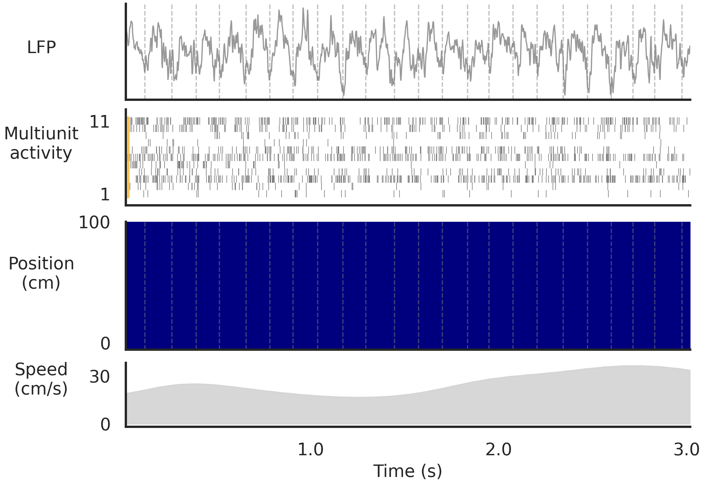
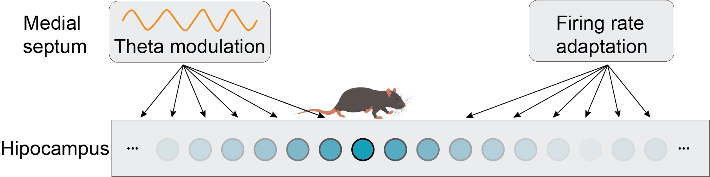
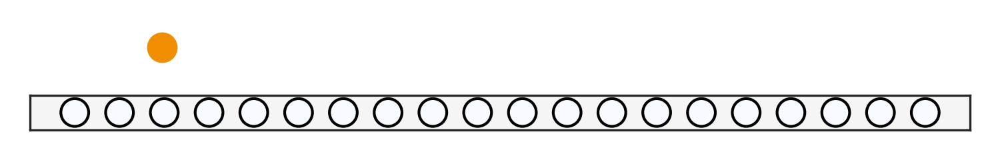
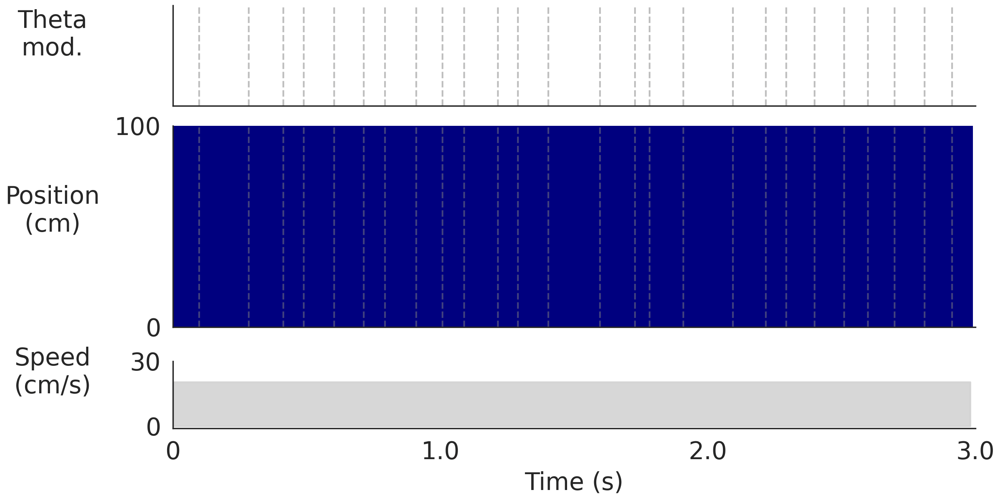

# Presentation
Data visualization for presentation. NB: different figures are generated under different repos. This repo is for tracking the figures and their corresponding repos.

## Section 1: theta sweeps in place cells when animal navigate in a linear track

### 1, theta sweeps in empirical place cell data in a linear track (data from Frank lab)

Simulated under Repo: AdaptiveAttractorForSequences > exp-analysis branch > Presentation_pcthetasweeps.ipynb

### 2, theta sweeps in a continuous attractor network (CAN) model (Chu*&Ji* et al., 2024, eLife)

Simulated under Repo: HDPhasePrecession > computational_model > Presentation_pcsweeps_model.ipynb

Bump sweeps in a CAN with theta modulation and firing rate adaptation:

Unfold in time:

### 3, population sweeps lead to singel-cell theta phase precession 

## Section 2: theta sweeps in head direction cells in open field navigation (Ji*&Lomi* et al, 2025, Hippocampus)

## Section 3: left-right theta sweeps in grid cells in open field navigation
